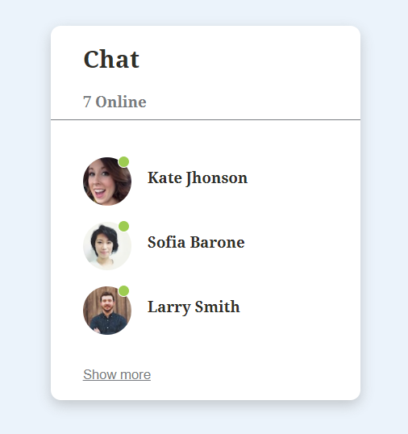
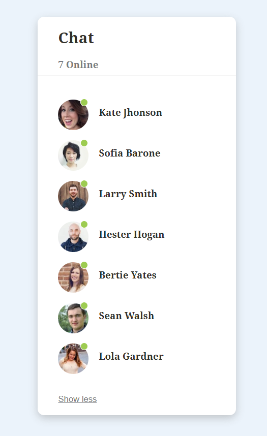

# Chat Panel

## Table of contents

- [Overview](#overview)
  - [Screenshot](#screenshot)
  - [Links](#links)
- [My process](#my-process)
  - [Built with](#built-with)

## Overview

- Building Chat Panel using useState React Hook

### Screenshot

### Links

- Live Site URL: [Click Here](https://chat-panel.netlify.app/)

- [Design inspiration](https://www.uidesigndaily.com/posts/figma-chat-panel-message-messaging-list-app-mobile-day-931)

## My process

### Built with

- Semantic HTML5 markup
- CSS custom properties
- Flexbox
- CSS Grid
- React.js
