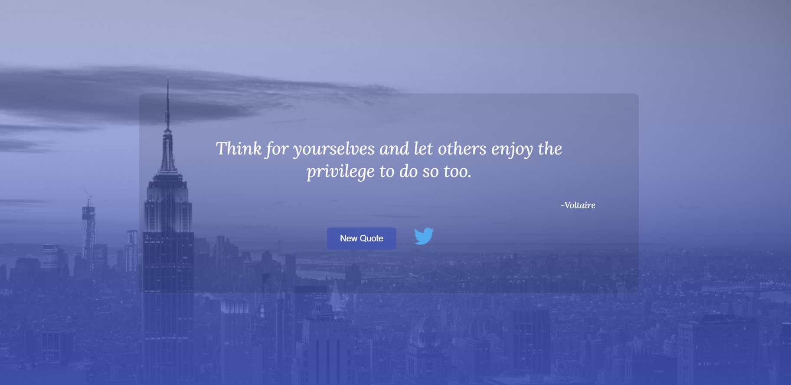

# Chat Panel

## Table of contents

- [Overview](#overview)
  - [Screenshot](#screenshot)
  - [Links](#links)
- [My process](#my-process)
  - [Built with](#built-with)

## Overview

### FreeCodeCamp Front End Development Libraries Project - [Random Quote Machine](https://www.freecodecamp.org/learn/front-end-libraries/front-end-libraries-projects/build-a-random-quote-machine)

    - Generates quotes at the page load and also when 'New Quote' button is clicked.
    - Clicking on twitter icon tweets the current quote.

### Screenshot

### Links

- Live Site URL: [Click Here](https://random-quote-machine-03.netlify.app/)

### Built with

- Semantic HTML5 markup
- CSS custom properties
- Flexbox
- CSS Grid
- React.js
- AOS (Animate On Scroll Library)
