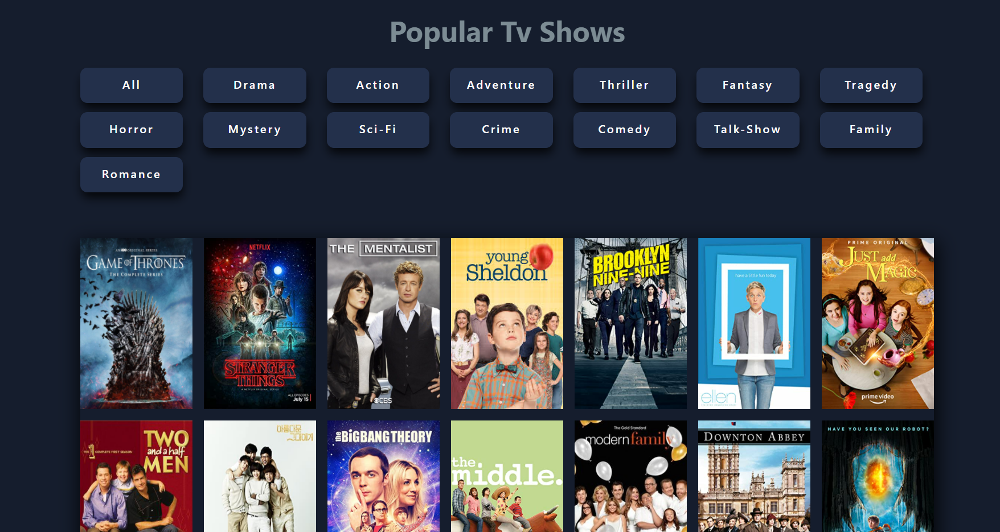

## Tv-Shows React App

- [Live URL](https://tv-shows-react-app.netlify.app/)

### Built using

- Contentful - Contentful provides a content infrastructure for digital teams to power content in websites, apps, and devices.

- ReactJS

### `npm start`

Runs the app in the development mode.\
Open [http://localhost:3000](http://localhost:3000) to view it in the browser.

### Useful Resources

#### Contentful

- [contentful.js](https://contentful.github.io/contentful.js/contentful/6.1.1/)

> Installation **npm install contentful**

> Using ES6 import

    // import everything from contentful
    import * as contentful from 'contentful'
    const client = contentful.createClient({
    // This is the space ID. A space is like a project folder in Contentful terms
    space: 'developer_bookshelf',
    // This is the access token for this space. Normally you get both ID and the token in the Contentful web app
    accessToken: '0b7f6x59a0'
    })

> Advanced features - Link resolution

    const response = await client.getEntries({'content_type': 'content type name'});
    const responseData = await response.items;

## Desktop View

