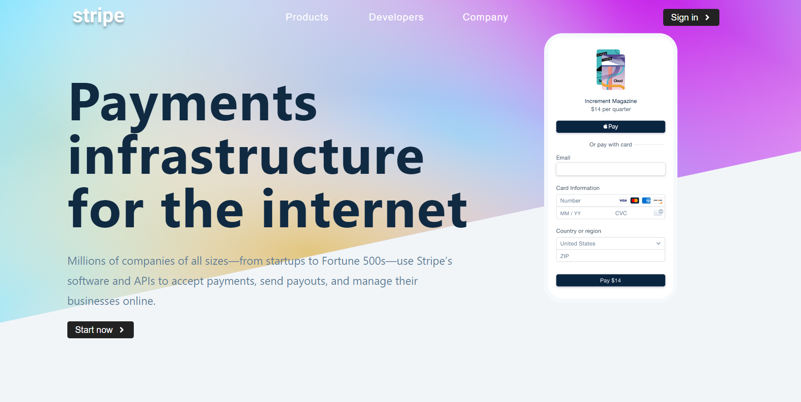
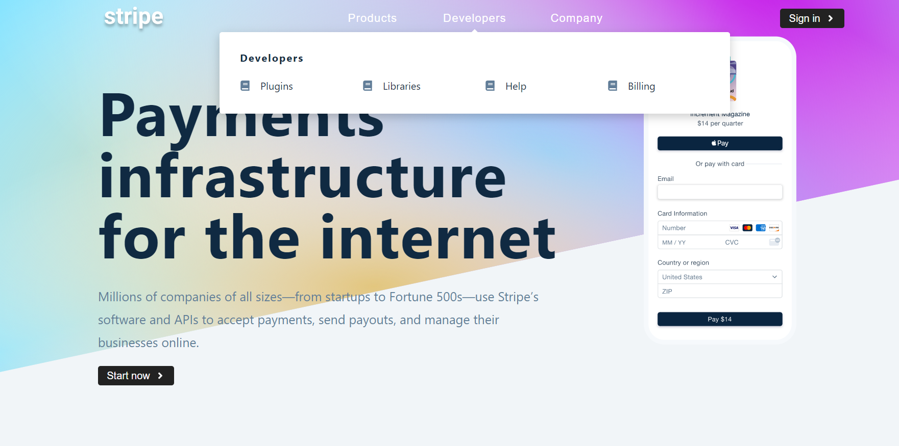
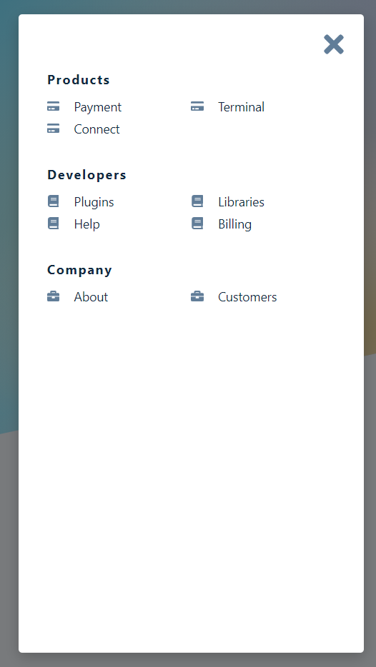

## Stripe Submenus App ( useContext and Context API )

- This project is a part of the course - 'React Tutorial and Projects Course' by John Smilga.
- For practising useContext Hook.

## Table of contents

- [Overview](#overview)
- [Links](#links)
- [Screenshot](#screenshot)
- [Built with](#built-with)

## Overview

Users should be able to:

- View the optimal layout for the app depending on their device's screen size
- See hover states for all interactive elements on the page
- View Submenus when hovered on buttons in navbar
- View Sidebar on smaller screen using hamburger icon

## Links

- Solution URL: [Solution](https://github.com/SaiPradeepti/My-React-Projects/tree/main/07-stripe-submenus)
- Live Site URL: [Live Site](https://stripe-submenus-sp.netlify.app/)

## Screenshots

|              |                                |                                |
| :----------- | :----------------------------: | :----------------------------: |
| Desktop View |  |  |
| Mobile View  |  |  |

## Built with

- Semantic HTML5 markup
- CSS custom properties
- Flexbox
- SASS
- React.js
