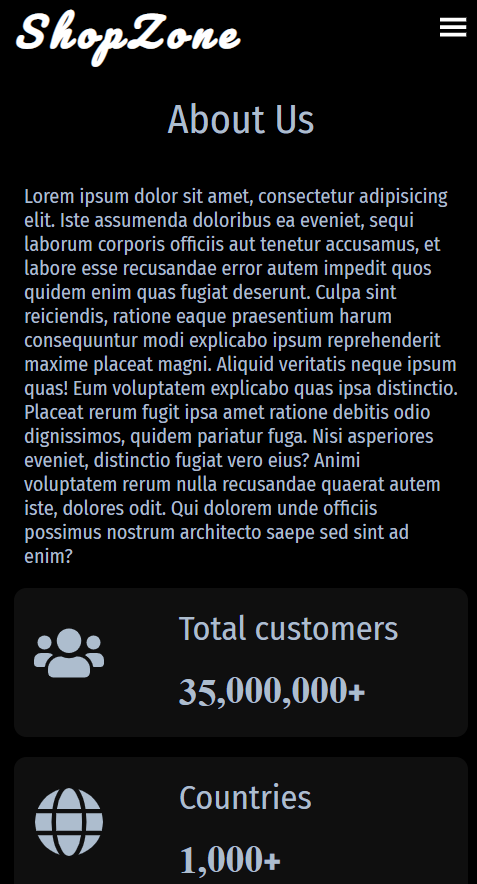

# ShopZone

## Table of contents

- [Overview](#overview)
- [Links](#links)
- [Screenshot](#screenshot)
- [Built with](#built-with)

## Overview

Users should be able to:

- View the optimal layout for the app depending on their device's screen size
- See hover states for all interactive elements on the page
- View items, click on individual item to see item details
- View total count of items on navbar
- View cart items and total count of items and total cost of items.
- Increase and decrease the quantity of each item
- Remove item from the cart

## Links

- Solution URL: [Solution](https://github.com/SaiPradeepti/React-Projects/tree/main/09-shopzone)
- Live Site URL: [Live Site](https://shopzone-pradeepti.netlify.app/)

## Screenshots

|          Desktop View          |           Mobile View           |
| :----------------------------: | :-----------------------------: |
|  |   |
|  |   |
|  |   |
|  |   |
|  |  |

## Built with

- Semantic HTML5 markup
- CSS custom properties
- Flexbox
- SASS
- React.js
