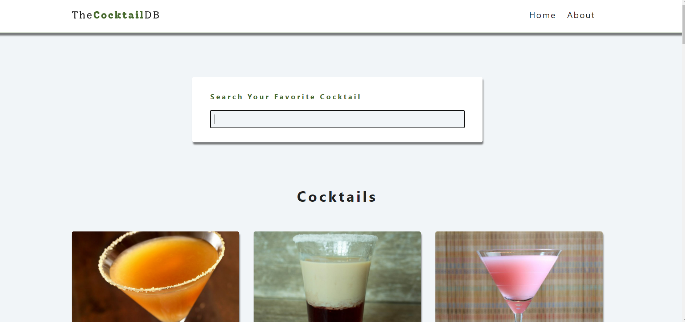
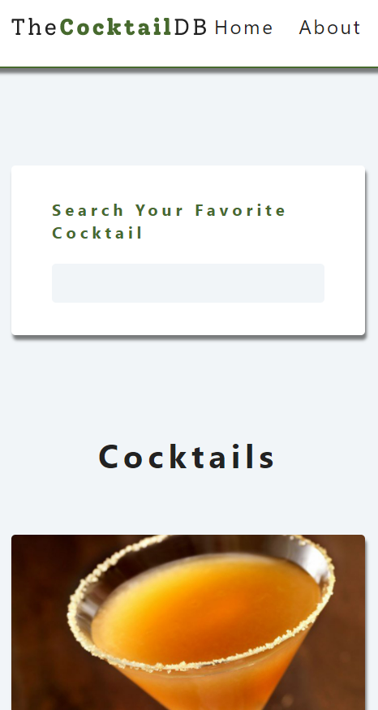

## Cocktail App

## Table of contents

- [Overview](#overview)
- [Links](#links)
- [Screenshot](#screenshot)
- [Built with](#built-with)
- [Acknowledgement](#acknowledgement)

## Overview

Users should be able to:

- View the optimal layout for the app depending on their device's screen size
- See hover states for all interactive elements on the page
- View items and see individual item's details.

## Links

- Solution URL: [Solution](https://github.com/SaiPradeepti/React-Projects/tree/main/10-cocktails)
- Live Site URL: [Live Site](https://cocktails-sp.netlify.app/)

## Screenshots

|          Desktop View          |          Mobile View           |
| :----------------------------: | :----------------------------: |
|  |  |

## Built with

- Semantic HTML5 markup
- CSS custom properties
- Flexbox
- SASS
- React.js

## Acknowledgement

- This project is a part of the course - 'React Tutorial and Projects Course' by John Smilga.
- For practising React Hooks and React Router.
